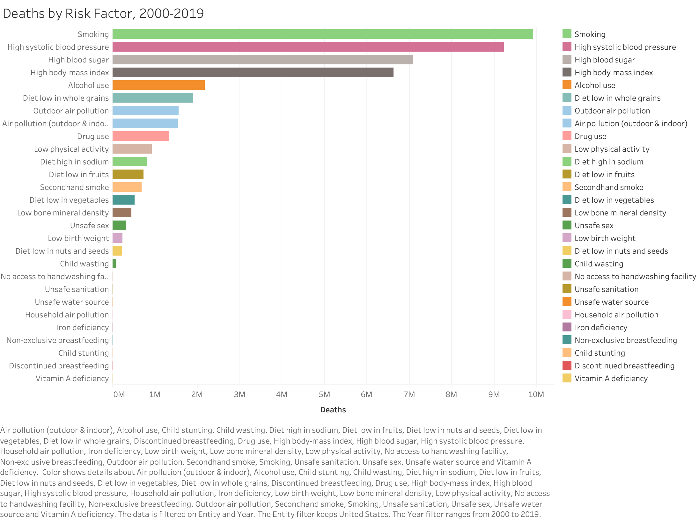

# PollutionSight

At PollutionSight, our goal is to keep an eye on pollution with a look toward the future. We will analyze air pollution data from the United States from the years 2000 to 2016 to identify and visualize patterns and then create a machine learning model to predict future pollutant levels in specific cities.

## Project Overview
 1) Why, What, and When
 2) Project Goals
 3) The Team
 4) Tolls Used
 5) Presentation and Dashboard
 6) Data Visuals

## Why, What, and When

### Why analyze pollution?
Outdoor air pollution is one of the biggest environmental problems in the world. Possibly because it is not necessarily a visible concern and the health effects aren't usually immediate, it is an issue that only some countries have begun to take seriously. However, there is increasing evidence that exposure to pollution leads to negative health outcomes. In 2019 alone, outdoor air pollution was one of the leading risk factors for deaths in the United States:
 

 
Additionally, the cognitive effects of exposure to air pollution are just beginning to be understood and have a significant impact on many aspects of our daily lives. In fact, a **[study from the University of Chicago](https://www.journals.uchicago.edu/doi/full/10.1086/698728)** indicates that even a 1 ppm increase in 3-hour CO makes umpires 11.5% more likely to make an incorrect call. Interestingly, a **[study from the National Bureau of Economic Research](https://www.nber.org/system/files/working_papers/w22753/w22753.pdf)** shows that pollution also negatively affects the stock market. An increase in PM2.5 of one standard deviation in Manhattan leads to a 11.9% decrease in returns on the NYSE. Also, cognitive scores in rooms with approximately 945 ppm and 1400 ppm of CO2 were 15% and 50%, respectively, lower than in green rooms with higher ventilation that had approximately 550 ppm of CO2, according to a **[study from Harvard University](https://dash.harvard.edu/bitstream/handle/1/27662232/4892924.pdf?sequence=1)**.
 
### What Data are we using, When was this data collected.
To perform our analysis, we selected a dataset from Kaggle that contains the pollution levels of Nitrogen Dioxide(NO2), Sulphur Dioxide(SO2), Carbon Monoxide(CO) and Ozone(O3) for 2000-2016. Additionally, we compiled AQI levels for 2000-2022 from the United States Evironmental Protection Agency. To see the effect that population has on pollution, we used population data from the United States Census Bureau.
 
## Project Goal
With our analysis, we hope to answer some important questions about pollution in the United States:
 
* What are the top pollution levels across the united states?
* Can we use the pollution data to help us predict other aspects of pollution?
* What effect does population have on pollution?
* What effect does geography have on pollution?
 
## The Team

### Task Management
Our team split tasks as follow:
* Person 1 - Machine Learning - Data Cleaning
    * The first individual was tasked with creating a machine learning program to predict api based on other variables. This portion of the project is significantly more complex than any other and we felt it was ideal to have an individual dedicated solely to the subject. Although this included Data Cleaning specifically targeting the Machine Learning aspect.
* Person 2 - Github - Map Visualizations - Database
    * The second individual helped create and organize the Github, create map visualizing pollution trends, and helped organize our data into an AWS database.
* Person 3 - Dashboard - Team Engagement - State Visualization
    * The third individual helped create the dashboard and organize team meetings. In addition to that they helped create country wide year over year map visuals.
* Person 4 - Data Cleaning - SQL - Population and Geography (City)
    * The fourth individual worked on data cleaning and prepping before it was moved to our database, combined and filtered data in SQL, and created city level pollution visuals.

## Tools Used

### Communication
These were the programs used for communication:
* Slack
    > Used to communicate during off hours
* Zoom
    > Used during meetings
* Google Calendar
    > Booking meetings
 
### Data Cleaning and Organizing
These were the programs used to clean and organize our data:
* Python
    > Used to clean columns names, update field types, and move data onto our database
* SQL
    > Used to combine and filter data that fit specific createria
 
### Database
This program was used to store our data:
* AWS
    > Used to store our data
* Google Colab
    > Import data into AWS
* SQL
    > View and update data in AWS
 
### Data Visualization
These were the programs used to create our visualizations and dashboard
* Tableau
    > Used to create state and city statistics
* JavaScript
    > Used to create global data
* HTML
    > Used to create dashboard and but things together
 
## Presentation and Dashboard
**Presentation Outline**
* Why?
   * What was our reasoning behind this topic
* Data Source
   * Where did we obtain our data from. 
* Database and Tools
   * What tools did we use to help us in this project? 
* Machine Learning
   * What model did we use and what did we learn?
* Dashboard Overview
   * Exploring our dashboard and explaining what we did
* Thoughts and Questions 
   * Things we could have done better. Q and A. 

[Presentation](https://docs.google.com/presentation/d/1-q1f62aT4ipLGKyN-nhjjkpQ-auFi5T6wycMF4iLf2Y/edit?usp=sharing)
[Dashboard](https://vikashnin.github.io/Dashboard/)

## Data Visualizations 

[Yearly City Population vs Pollution](https://public.tableau.com/app/profile/jahid.miah/viz/YearlyTopPollutingStates/YearlyCityPopulationvsPollution?publish=yes)

[Yearly Top Polluting States](https://public.tableau.com/app/profile/jahid.miah/viz/YearlyTopPollutingStates/YearlyTopPollutingStates)

[Yearly Pollution Maps(Cities)](https://public.tableau.com/app/profile/jahid.miah/viz/YearlyPollutionStats/YearlyPollutionMaps?publish=yes)
